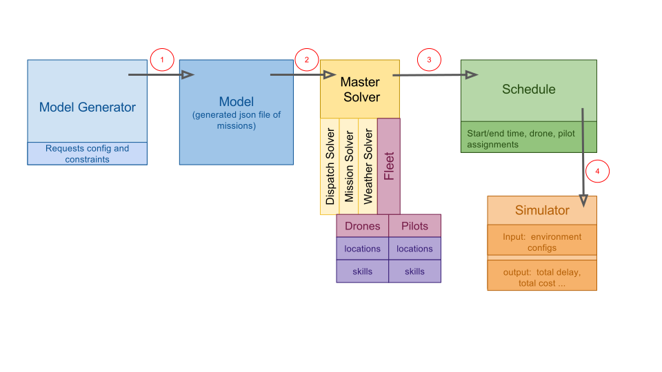

# Introduction to Drone Request Scheduling
A drone request is a set of instructions that a consumer provides to a drone service provider and drone pilot.  The request may include an area on a map and explicit instruction of what the pilot should photograph.  An example [(ER1)](TODO) might include a [request](#request) for a drone to take aerial images of the guests at a wedding.  This example is tightly constrained by the start and end time.  A request becomes a [mission](#mission) which has 1 flight.   Another example [(ER2)](TODO) might be a request for all the cell towers in Cook county to be inspected and photographed by the drone.    All the mission must be flown for this request by the by May 25, and should only be carried out on sunny days that have moderate to low wind (< 25 knots).   This request specifically  states that the images must be at least 12mb and should capture each cell and Microwave dish in full frame.  They should also include infrared images of all the equipment as well.  This request is loosely constrained by time but tightly constrained by environmental conditions such as brightness (lumens ), equpment and drone/pilot skills.  All requests are implicitly constrained by some environmental factors like rain or extreme cold.

The act of scheduling would assign both a drone and a pilot to a mission such that both the drone and the pilot's output would be maximized. A **schedule** would include the assigned pilot, drone and predicted start times, end times for each request/mission.   The schedule is a function of:

  1. The relative location of the request to the drones base
  2. The ability of a drone and a pilot (skills) which may include equipment like infrared camera as well as the pilots experience of a specific task like inspecting cell towers.
  3. The predicted weather for that operational area for that given day
  4. The cost of operation for a particular drone and pilot
  5. The time/cost to travel between assignments
  6. Plus future considerations

This is but a small sample set of constraints that may come into play with request scheduling.  A primary goal of this objective is to build a robust extensible platform that would allow us to add new parameters and constraints to the request scheduling.  See the first challenge [Scheduling Architecture Component Survey](challenges/schedulingArchitectureComponentSurvey.md) to see the first challenge where we will explore the components to built this scheduling tool.

---

# One proposed approach
Topcoder's mtwomey and kbowerma have drafted an approach to scheduling described by the image below and followed by a description of each of the scheduling components and utility harness.  From the perspective of scheduling we are only looking at missions (requests that contain a flight plan provide by a pilot.)  However for clarity we  may refer to the mission and the request interchangeably in the sections below.



## Model Generator
The model generator is a piece of utility code the makes multiple drone service requests simulating many customer create requests on the DSP for a given time period for a given operational period.   This tool will be used only by developers to create quasi random request.  It uses a single config file that defines groups of similar request each with constrains and varying degrees of randomness.  It can define a count of each type of request as well as an operational area:  a geographic bounding area that all the requests will be inside of.  The operation area should contain a centroid latitude and longitude or lat/lon of the corners.  We want these tied to real locations so we can use actual road routing and calculate travel time between missions and use roads for drone flight corridors when we add delivery.  Below is a representation of what a config file might contain.  Besides the config file, this utility will also include a binary or script that will generate the model.

```
{
Model Version:  1.1
Operation Area: {
  Total Area: 40km,
  Width: 5km,
  Length: 8km,
  Centroid: [-88.51,41.89],
  Operation Start time:  0700,
  Operation End time:  1800,
  Avg Ground Travel Speed:  35kph   
},
Requests: {
  Total:  30,
  Imagery type1 count:  8,
  Imagery type2 count:  9,
  Imagery type3 count:  5,
  Delivery count: 8
}
Conditions: {
  Predicted Lumen: [8,9,10,4,3,8]
  Predicted Wind: [7,7,8,14,20,21,23,18,10,3]
}
Type1 Constraints: {
  Min Lumen: 4,
  Max Wind: 20,
  Delay Probability: 15%
}
Type2 Constraints: {
  Avg Duration:  30 minutes
  Duration stdev:  12
  Start Time: fixed
  Max Wind: 21,
  Delay Probability: 5%
}
```

## Model

The model is simply output of the model generator.   It will be a JSON file that should look identical to the request (actually mission) collections in the database.  We will save and catalogue these models so we can regression test the optimization logic of the scheduler.

## Master Solver and sub-solver.
The master solver is the main chuck of code who is responsible for creating the **schedule** for the given area of operation and time frame.  It uses specific sub-solver modules, that can be added or updated, which each solve a specific task.   For example there maybe a *dispatch solver* that only specializes on drive times between requests and optimize based on a classic delivery truck algorithm.   Another sub-solver might be called the *Mission Solver* and it only focuses on matching the request to the right drone and pilot.  A weather sub-solver may only focus on scheduling the request based on the predicted weather or environmental conditions. We also expect each of these sub-solver to talk only to the master solver and that it may need to take the result of one sub-solver and re-run another sub-solver module to iterate on the final schedule.  For example the dispatch solver may optimized for road traffic and travel times between missions.   However if the weather solver adds a delay due to wind conditions, this updated schedule may need to feed back into the dispatch solver because now it needs to deal with rush hour. It is very important that the design for the solver and sub-solver be modular and future considerate.   We know that we will always be adding new sub-solvers drone scheduling more intelligent.  

The master solver queries the collection of assets which include drones and pilots.  These assets have properties of *location* and *skills* which should each be matched agains the requests.  Initially we  will start with only these two types of assets with only two properties each, but eventually want to add others assets like batteries, propellers and motors to name but a few.  The master solver provides the union of the fleet and the model to provide the **optimal** schedule.

## Schedule
The Schedule is simply the output of the master solver.   At a minimum it should include the start time and end time for each mission as well as the drone and pilot assigned.  Total cost, air time for each drone and pilot are also examples of useful metrics for each of the missions and also globally for the entire time period. The start and end time are functions of the probability of delay due to factors like weather, however these are not actual values only predictions.  The actual values play into the next module, the simulator.

## Simulator
Once the schedule has been created the simulator is a developer utility that is used to test schedule.   Where as the scheduler is based on probability of an occurrence, (like the probability of it raining at a certain time ), the simulator is based on certainty.   Like the model generator, the simulator will contain actual conditions like it was raining between 12:43 and 3:15.  The output of this code will produce statistics like how many missions were delayed, and the total number of delayed minutes,  and the cost related to the equipment and the pilot.  It seems very likely that the generator and the simulator maybe created from the same code base and are distinguished from a command line switch.

# This Challenge
The description above is one approach (option1) we have come up with.   Now we would like to vet it and hear from you.   Please submit a document that discusses some or all of the following or anything else that you think is pertinent.

1. Is the option1 sound?   Can you make any suggestions or modifications that will make it more robust.  
2. Can you identify any tools libraries or frameworks (examples like pygame or json-rules-engine ) that we can leverage so we don't have to write this all from scratch.
3. Provide some example code.
4. Provide sample generator config file and model output.
5. Define primary scheduling and simulation metrics for success or failure (total delay time, total operational cost,  others? ... )
4. Reference routing or similar concepts that will be useful to other competitors when we move this to the development phase.
5. Are the terms use above correct?   Are there better terms to describe this problem and solution?


>This challenge is purely subjective.   The submission will be ranked from best to worst based on the judges option and there will be no appeal.
